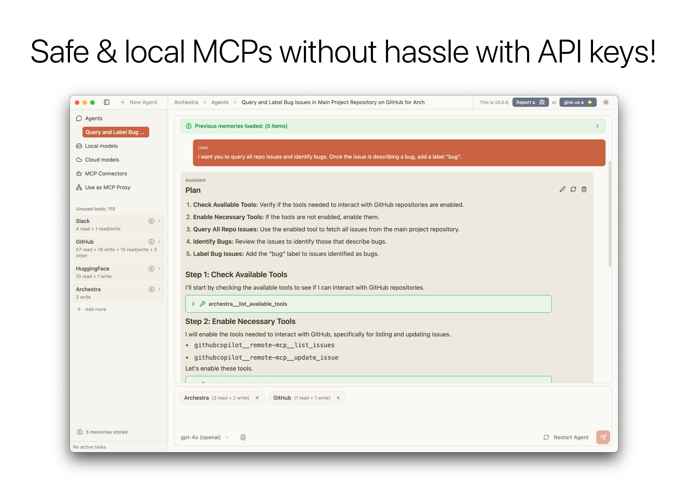
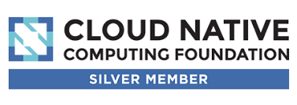

# Archestra Desktop — simplest MCP client

   

---

## 🚀 Overview

Archestra is a 100% local runtime for MCP (Model Context Protocol) servers and a ChatGPT-like UI allowing non-technical users to build safe and private agents with powerful data access.

### Key Features

- 🔒 **Sandboxed MCP Runtime** - Isolated execution environment protecting the host.
- 🔥 **Unique Auth** — No need to toss API keys and config files to run MCP!
- 🔌 **MCP Protocol Support** - Compatible with thousands of existing MCP servers and custom implementations
- 💻 **Local-First Architecture** - Privacy-focused design with local LLM

## 🤝 Contributing

We welcome contributions from the community! [Contribution guideline](https://www.archestra.ai/docs/contributing).

---

   
  
  &nbsp;&nbsp;&nbsp;&nbsp;&nbsp;&nbsp;
  

